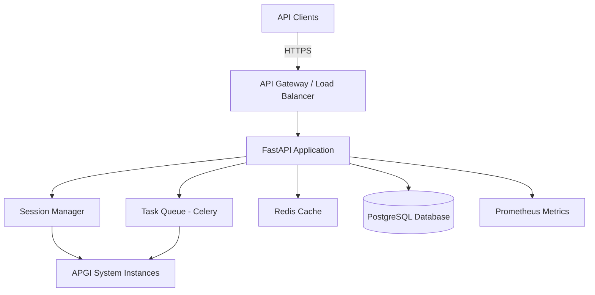

# Design Document

## Overview

The APGI REST API provides programmatic access to the Allostatic Precision-Gated Ignition System through a comprehensive HTTP interface. The API enables researchers and developers to create, configure, and control APGI simulations, access real-time system state, execute experimental tasks, and export data for analysis.

The design follows REST principles with resource-oriented endpoints, standard HTTP methods, and JSON payloads. The API is built using FastAPI (Python) for automatic OpenAPI documentation generation, request validation, and high performance. The architecture supports multiple concurrent simulation sessions, asynchronous task execution, and real-time event streaming.

### Key Design Goals

1. **Developer Experience**: Intuitive endpoints with comprehensive documentation and consistent patterns
2. **Performance**: Efficient handling of concurrent simulations and real-time data access
3. **Extensibility**: Plugin architecture for custom experimental tasks and analysis modules
4. **Security**: Authentication, authorization, and rate limiting to protect resources
5. **Observability**: Comprehensive logging, metrics, and monitoring for production deployment

## Architecture

### High-Level Architecture



### Component Layers

1. **API Layer**: FastAPI application handling HTTP requests, validation, and responses
2. **Business Logic Layer**: Session management, task orchestration, and data processing
3. **Domain Layer**: APGI system instances and experimental task implementations
4. **Data Layer**: PostgreSQL for persistent storage, Redis for caching and session state
5. **Infrastructure Layer**: Monitoring, logging, authentication, and deployment

### Technology Stack

- **Web Framework**: FastAPI 0.100+ (async support, automatic OpenAPI generation)
- **ASGI Server**: Uvicorn with Gunicorn for production
- **Task Queue**: Celery with Redis broker for async operations
- **Database**: PostgreSQL 14+ for persistent storage
- **Cache**: Redis 7+ for session state and rate limiting
- **Authentication**: JWT tokens with PyJWT
- **Validation**: Pydantic v2 for request/response schemas
- **Documentation**: Swagger UI (built-in) and ReDoc
- **Monitoring**: Prometheus + Grafana
- **Logging**: Structured logging with Python logging + ELK stack
- **Deployment**: Docker containers orchestrated with Kubernetes

## Components and Interfaces

### 1. API Application (FastAPI)

**Responsibilities**:
- Route HTTP requests to appropriate handlers
- Validate request payloads using Pydantic models
- Serialize responses to JSON
- Handle CORS, authentication, and rate limiting middleware
- Generate OpenAPI specification

**Key Classes**:

```python
class APGIAPIApp:
    """Main FastAPI application."""
    
    def __init__(self):
        self.app = FastAPI(
            title="APGI System API",
            version="1.0.0",
            description="REST API for consciousness modeling"
        )
        self.session_manager = SessionManager()
        self.task_executor = TaskExecutor()
        
    def setup_routes(self):
        """Register all API routes."""
        pass
        
    def setup_middleware(self):
        """Configure middleware (CORS, auth, rate limiting)."""
        pass
```

### 2. Session Manager

**Responsibilities**:
- Create and manage APGI system instances
- Track active simulation sessions
- Handle session lifecycle (create, start, pause, stop, delete)
- Manage session state persistence and recovery

**Key Classes**:

```python
class SessionManager:
    """Manages APGI simulation sessions."""
    
    def __init__(self, redis_client, db_connection):
        self.sessions: Dict[str, SimulationSession] = {}
        self.redis = redis_client
        self.db = db_connection
        
    async def create_session(self, config: SessionConfig) -> str:
        """Create new simulation session."""
        pass
        
    async def get_session(self, session_id: str) -> SimulationSession:
        """Retrieve existing session."""
        pass
        
    async def delete_session(self, session_id: str):
        """Clean up session resources."""
        pass

class SimulationSession:
    """Represents a single APGI simulation instance."""
    
    def __init__(self, session_id: str, config: SessionConfig):
        self.session_id = session_id
        self.apgi_system = APGISystem(config_path=config.config_path)
        self.state = SessionState.CREATED
        self.created_at = datetime.utcnow()
        self.lock = asyncio.Lock()
        
    async def start(self):
        """Start simulation."""
        pass
        
    async def pause(self):
        """Pause simulation."""
        pass
        
    async def step(self, extero_input: np.ndarray) -> Dict:
        """Execute single simulation step."""
        pass
        
    async def get_state(self) -> Dict:
        """Get current system state."""
        pass
```

### 3. Request/Response Models (Pydantic)

**Responsibilities**:
- Define API contracts for requests and responses
- Validate incoming data
- Serialize outgoing data
- Generate OpenAPI schemas

**Key Models**:

```python
class SessionCreateRequest(BaseModel):
    """Request to create new simulation session."""
    config_path: Optional[str] = None
    custom_config: Optional[Dict[str, Any]] = None
    description: Optional[str] = None

class SessionCreateResponse(BaseModel):
    """Response with new session details."""
    session_id: str
    status: str
    created_at: datetime
    config: Dict[str, Any]

class SystemStateResponse(BaseModel):
    """Complete system state."""
    time_ms: float
    ignition: IgnitionState
    workspace: WorkspaceState
    body: BodyState
    allostasis: AllostaticState
    precision: PrecisionState
    metabolism: MetabolicState
    self_model: SelfModelState
    
class IgnitionState(BaseModel):
    """Ignition subsystem state."""
    ignition_occurred: bool
    total_signal: float
    threshold: float
    duration_ms: Optional[float] = None
```

### 4. Task Executor (Celery)

**Responsibilities**:
- Execute long-running experimental tasks asynchronously
- Manage task queue and worker processes
- Store task results and provide status updates
- Handle task retries and failures

**Key Classes**:

```python
class TaskExecutor:
    """Executes experimental tasks asynchronously."""
    
    def __init__(self, celery_app):
        self.celery = celery_app
        
    async def submit_task(
        self, 
        session_id: str, 
        task_type: str, 
        parameters: Dict
    ) -> str:
        """Submit task for async execution."""
        pass
        
    async def get_task_status(self, task_id: str) -> TaskStatus:
        """Get current task status."""
        pass
        
    async def get_task_result(self, task_id: str) -> Dict:
        """Retrieve completed task results."""
        pass

@celery_app.task
def execute_iowa_gambling_task(session_id: str, parameters: Dict) -> Dict:
    """Celery task for Iowa Gambling Task."""
    pass
```

### 5. Authentication & Authorization

**Responsibilities**:
- Validate JWT tokens
- Extract user identity and permissions
- Enforce role-based access control
- Handle token refresh

**Key Classes**:

```python
class AuthManager:
    """Handles authentication and authorization."""
    
    def __init__(self, secret_key: str):
        self.secret_key = secret_key
        
    def create_token(self, user_id: str, roles: List[str]) -> str:
        """Generate JWT token."""
        pass
        
    def verify_token(self, token: str) -> TokenPayload:
        """Verify and decode JWT token."""
        pass
        
    def check_permission(self, user: User, resource: str, action: str) -> bool:
        """Check if user has permission."""
        pass

class TokenPayload(BaseModel):
    """JWT token payload."""
    user_id: str
    roles: List[str]
    exp: datetime
```

### 6. Rate Limiter

**Responsibilities**:
- Track request counts per client
- Enforce rate limits using sliding window
- Return appropriate headers and error responses

**Key Classes**:

```python
class RateLimiter:
    """Redis-based rate limiter."""
    
    def __init__(self, redis_client):
        self.redis = redis_client
        
    async def check_rate_limit(
        self, 
        client_id: str, 
        endpoint: str, 
        limit: int, 
        window_seconds: int
    ) -> RateLimitResult:
        """Check if request is within rate limit."""
        pass
        
    def get_rate_limit_headers(self, result: RateLimitResult) -> Dict[str, str]:
        """Generate rate limit headers."""
        pass
```

### 7. Data Export Service

**Responsibilities**:
- Export simulation data in multiple formats (JSON, CSV)
- Support pagination for large datasets
- Generate summary statistics and reports

**Key Classes**:

```python
class DataExportService:
    """Handles data export operations."""
    
    async def export_session_data(
        self, 
        session_id: str, 
        format: str, 
        filters: Optional[Dict] = None
    ) -> bytes:
        """Export complete session data."""
        pass
        
    async def export_time_series(
        self, 
        session_id: str, 
        variables: List[str], 
        start_time: float, 
        end_time: float
    ) -> Dict:
        """Export time series data."""
        pass
        
    async def generate_summary_stats(self, session_id: str) -> Dict:
        """Compute summary statistics."""
        pass
```

## Data Models

### Session Data Model

```python
@dataclass
class SessionConfig:
    """Configuration for simulation session."""
    config_path: Optional[str] = None
    custom_config: Optional[Dict[str, Any]] = None
    timestep_ms: float = 10.0
    max_duration_ms: float = 60000.0

@dataclass
class SessionMetadata:
    """Metadata for simulation session."""
    session_id: str
    user_id: str
    created_at: datetime
    updated_at: datetime
    description: Optional[str] = None
    tags: List[str] = field(default_factory=list)
    
class SessionState(Enum):
    """Session lifecycle states."""
    CREATED = "created"
    RUNNING = "running"
    PAUSED = "paused"
    STOPPED = "stopped"
    ERROR = "error"
```

### Task Data Model

```python
@dataclass
class TaskDefinition:
    """Definition of experimental task."""
    task_id: str
    task_type: str
    session_id: str
    parameters: Dict[str, Any]
    created_at: datetime
    
@dataclass
class TaskResult:
    """Results from completed task."""
    task_id: str
    status: TaskStatus
    result_data: Dict[str, Any]
    started_at: datetime
    completed_at: Optional[datetime] = None
    error_message: Optional[str] = None
    
class TaskStatus(Enum):
    """Task execution states."""
    PENDING = "pending"
    RUNNING = "running"
    COMPLETED = "completed"
    FAILED = "failed"
```

### Database Schema

```sql
-- Sessions table
CREATE TABLE sessions (
    session_id VARCHAR(36) PRIMARY KEY,
    user_id VARCHAR(36) NOT NULL,
    config JSONB NOT NULL,
    state VARCHAR(20) NOT NULL,
    created_at TIMESTAMP NOT NULL,
    updated_at TIMESTAMP NOT NULL,
    description TEXT,
    tags TEXT[]
);

-- Tasks table
CREATE TABLE tasks (
    task_id VARCHAR(36) PRIMARY KEY,
    session_id VARCHAR(36) REFERENCES sessions(session_id),
    task_type VARCHAR(50) NOT NULL,
    parameters JSONB NOT NULL,
    status VARCHAR(20) NOT NULL,
    result_data JSONB,
    created_at TIMESTAMP NOT NULL,
    started_at TIMESTAMP,
    completed_at TIMESTAMP,
    error_message TEXT
);

-- Session data table (time series)
CREATE TABLE session_data (
    id BIGSERIAL PRIMARY KEY,
    session_id VARCHAR(36) REFERENCES sessions(session_id),
    time_ms FLOAT NOT NULL,
    data JSONB NOT NULL,
    created_at TIMESTAMP NOT NULL
);

CREATE INDEX idx_session_data_session_time ON session_data(session_id, time_ms);

-- Users table
CREATE TABLE users (
    user_id VARCHAR(36) PRIMARY KEY,
    username VARCHAR(100) UNIQUE NOT NULL,
    email VARCHAR(255) UNIQUE NOT NULL,
    password_hash VARCHAR(255) NOT NULL,
    roles TEXT[] NOT NULL,
    created_at TIMESTAMP NOT NULL,
    last_login TIMESTAMP
);
```

## Correctness Properties

*A property is a characteristic or behavior that should hold true across all valid executions of a system-essentially, a formal statement about what the system should do. Properties serve as the bridge between human-readable specifications and machine-verifiable correctness guarantees.*

Before defining the correctness properties, let me analyze the acceptance criteria for testability:


### Property Reflection

After reviewing all testable properties from the prework, I've identified opportunities to consolidate redundant properties:

**Consolidations**:
- Properties 3.1-3.5 (state access endpoints) can be combined into a single property about response completeness
- Properties 4.1-4.3 (experimental tasks) can be combined into a single property about task execution
- Properties 8.1-8.3 (rate limiting headers) can be combined into a comprehensive rate limiting property
- Properties 9.3-9.4 (documentation completeness) can be combined into a single documentation property

This reduces redundancy while maintaining comprehensive validation coverage.

### Correctness Properties

Property 1: HTTP status code correctness
*For any* API request (valid or invalid), the response status code should match the outcome: 2xx for success, 4xx for client errors, 5xx for server errors
**Validates: Requirements 1.1**

Property 2: JSON response structure consistency
*For any* successful API request, the response should be valid JSON containing data and metadata fields
**Validates: Requirements 1.2**

Property 3: Error response completeness
*For any* API request that results in an error, the response should include an error message, error code, and request ID
**Validates: Requirements 1.3**

Property 4: CORS header presence
*For any* API request, the response should include appropriate CORS headers (Access-Control-Allow-Origin, etc.)
**Validates: Requirements 1.5**

Property 5: Session creation round-trip
*For any* valid session configuration, creating a session then retrieving it should return the same configuration
**Validates: Requirements 2.1**

Property 6: Simulation state preservation on pause
*For any* running simulation, pausing then immediately checking state should show the same values as before pause
**Validates: Requirements 2.3**

Property 7: Simulation reset idempotence
*For any* simulation session, resetting it should restore to initial state, and resetting again should produce the same initial state
**Validates: Requirements 2.4**

Property 8: Session deletion invalidation
*For any* session, after deletion, attempting to access that session should return 404 Not Found
**Validates: Requirements 2.5**

Property 9: State response completeness
*For any* session state request, the response should include all required subsystems (ignition, workspace, body, allostasis, precision, metabolism, self_model)
**Validates: Requirements 3.1, 3.2, 3.3, 3.4, 3.5**

Property 10: Task execution and retrieval round-trip
*For any* experimental task, executing it and then retrieving results by task ID should return the complete task results
**Validates: Requirements 4.1, 4.2, 4.3, 4.5**

Property 11: Data export completeness
*For any* simulation session with recorded data, exporting the data should include all timesteps that were recorded
**Validates: Requirements 5.1**

Property 12: Time series data consistency
*For any* time series export request, the returned data should be ordered by timestamp and contain only the requested variables
**Validates: Requirements 5.3**

Property 13: Pagination consistency
*For any* paginated request, following all pagination links should eventually return all data without duplicates or gaps
**Validates: Requirements 5.5**

Property 14: API versioning in paths
*For any* registered API endpoint, the path should start with a version prefix (e.g., /v1/)
**Validates: Requirements 6.1**

Property 15: Deprecation header presence
*For any* deprecated endpoint, responses should include a Deprecation header with warning information
**Validates: Requirements 6.5**

Property 16: Authentication token round-trip
*For any* valid credentials, authenticating should return a token that can be used to make authenticated requests successfully
**Validates: Requirements 7.1, 7.2**

Property 17: Authorization enforcement
*For any* operation requiring specific permissions, requests without those permissions should return 403 Forbidden
**Validates: Requirements 7.3, 7.5**

Property 18: Expired token rejection
*For any* expired JWT token, requests using that token should be rejected with 401 Unauthorized
**Validates: Requirements 7.4**

Property 19: Rate limit enforcement
*For any* client exceeding rate limits, subsequent requests should return 429 Too Many Requests until the window resets
**Validates: Requirements 8.1, 8.2**

Property 20: Rate limit header completeness
*For any* API request, the response should include rate limit headers (X-RateLimit-Limit, X-RateLimit-Remaining, X-RateLimit-Reset)
**Validates: Requirements 8.3, 8.4, 8.5**

Property 21: Documentation schema completeness
*For any* endpoint in the OpenAPI specification, it should include description, parameters, request schema, response schema, and error codes
**Validates: Requirements 9.3, 9.4**

Property 22: Request logging completeness
*For any* processed request, the log entry should include method, path, status code, duration, and client identifier
**Validates: Requirements 10.1**

Property 23: Error logging completeness
*For any* error that occurs, the log entry should include stack trace, request context, and a unique error ID
**Validates: Requirements 10.2**

Property 24: Metrics exposure
*For any* running API instance, the metrics endpoint should expose request rate, error rate, and response time percentiles
**Validates: Requirements 10.3**

Property 25: Async task status tracking
*For any* long-running task, polling the status endpoint should show progress updates until completion
**Validates: Requirements 11.1, 11.2**

Property 26: Webhook delivery with retry
*For any* completed async task with registered webhook, the system should attempt delivery with exponential backoff on failure
**Validates: Requirements 11.3, 11.4, 11.5**

Property 27: Response schema validation
*For any* API response, it should validate against the OpenAPI schema defined for that endpoint
**Validates: Requirements 12.3**

## Error Handling

### Error Response Format

All error responses follow a consistent structure:

```json
{
  "error": {
    "code": "SESSION_NOT_FOUND",
    "message": "Session with ID 'abc123' does not exist",
    "request_id": "req_7f8d9e0a1b2c",
    "timestamp": "2025-12-03T10:30:00Z",
    "details": {
      "session_id": "abc123"
    }
  }
}
```

### Error Categories

1. **Client Errors (4xx)**:
   - 400 Bad Request: Invalid request payload or parameters
   - 401 Unauthorized: Missing or invalid authentication token
   - 403 Forbidden: Insufficient permissions
   - 404 Not Found: Resource does not exist
   - 409 Conflict: Resource state conflict (e.g., starting already running simulation)
   - 422 Unprocessable Entity: Validation errors
   - 429 Too Many Requests: Rate limit exceeded

2. **Server Errors (5xx)**:
   - 500 Internal Server Error: Unexpected server error
   - 502 Bad Gateway: Upstream service failure
   - 503 Service Unavailable: Service temporarily unavailable
   - 504 Gateway Timeout: Request timeout

### Error Handling Strategy

```python
class APIError(Exception):
    """Base exception for API errors."""
    def __init__(self, code: str, message: str, status_code: int, details: Dict = None):
        self.code = code
        self.message = message
        self.status_code = status_code
        self.details = details or {}

class SessionNotFoundError(APIError):
    """Session does not exist."""
    def __init__(self, session_id: str):
        super().__init__(
            code="SESSION_NOT_FOUND",
            message=f"Session with ID '{session_id}' does not exist",
            status_code=404,
            details={"session_id": session_id}
        )

@app.exception_handler(APIError)
async def api_error_handler(request: Request, exc: APIError):
    """Handle API errors consistently."""
    request_id = request.state.request_id
    
    # Log error
    logger.error(
        f"API Error: {exc.code}",
        extra={
            "request_id": request_id,
            "error_code": exc.code,
            "details": exc.details
        }
    )
    
    # Return error response
    return JSONResponse(
        status_code=exc.status_code,
        content={
            "error": {
                "code": exc.code,
                "message": exc.message,
                "request_id": request_id,
                "timestamp": datetime.utcnow().isoformat() + "Z",
                "details": exc.details
            }
        }
    )
```

### Validation Errors

Pydantic validation errors are transformed into consistent error responses:

```python
@app.exception_handler(RequestValidationError)
async def validation_error_handler(request: Request, exc: RequestValidationError):
    """Handle Pydantic validation errors."""
    errors = []
    for error in exc.errors():
        errors.append({
            "field": ".".join(str(loc) for loc in error["loc"]),
            "message": error["msg"],
            "type": error["type"]
        })
    
    return JSONResponse(
        status_code=422,
        content={
            "error": {
                "code": "VALIDATION_ERROR",
                "message": "Request validation failed",
                "request_id": request.state.request_id,
                "timestamp": datetime.utcnow().isoformat() + "Z",
                "details": {"validation_errors": errors}
            }
        }
    )
```

## Testing Strategy

### Unit Testing

Unit tests verify individual components in isolation:

**Test Coverage**:
- Request/response model validation (Pydantic models)
- Business logic in service classes (SessionManager, TaskExecutor, etc.)
- Authentication and authorization logic
- Rate limiting algorithms
- Data export and formatting functions
- Error handling and exception transformation

**Testing Framework**: pytest with pytest-asyncio for async tests

**Example Unit Test**:

```python
@pytest.mark.asyncio
async def test_session_manager_create_session():
    """Test session creation with valid configuration."""
    manager = SessionManager(redis_client=mock_redis, db=mock_db)
    
    config = SessionConfig(timestep_ms=10.0)
    session_id = await manager.create_session(config)
    
    assert session_id is not None
    assert len(session_id) == 36  # UUID format
    
    session = await manager.get_session(session_id)
    assert session.config.timestep_ms == 10.0
    assert session.state == SessionState.CREATED
```

### Property-Based Testing

Property-based tests verify universal properties hold across many randomly generated inputs using the Hypothesis library.

**Property Test Configuration**:
- Minimum 100 iterations per property test
- Custom strategies for generating valid API requests, configurations, and data
- Stateful testing for session lifecycle properties

**Example Property Test**:

```python
from hypothesis import given, strategies as st
import hypothesis

@given(
    config=st.builds(
        SessionConfig,
        timestep_ms=st.floats(min_value=1.0, max_value=100.0),
        max_duration_ms=st.floats(min_value=1000.0, max_value=600000.0)
    )
)
@hypothesis.settings(max_examples=100)
@pytest.mark.asyncio
async def test_property_session_creation_round_trip(config):
    """
    **Feature: api-rest-interface, Property 5: Session creation round-trip**
    
    For any valid session configuration, creating a session then retrieving it
    should return the same configuration.
    """
    manager = SessionManager(redis_client=redis_client, db=db)
    
    # Create session
    session_id = await manager.create_session(config)
    
    # Retrieve session
    session = await manager.get_session(session_id)
    
    # Verify configuration matches
    assert session.config.timestep_ms == config.timestep_ms
    assert session.config.max_duration_ms == config.max_duration_ms
```

### Integration Testing

Integration tests verify complete request-response cycles through the API:

**Test Coverage**:
- End-to-end API workflows (create session → start → get state → export data)
- Authentication and authorization flows
- Rate limiting behavior
- Async task execution and webhook delivery
- Error handling across the stack

**Testing Framework**: pytest with httpx.AsyncClient for API testing

**Example Integration Test**:

```python
@pytest.mark.asyncio
async def test_complete_simulation_workflow(api_client, auth_token):
    """Test complete simulation workflow from creation to data export."""
    headers = {"Authorization": f"Bearer {auth_token}"}
    
    # Create session
    response = await api_client.post(
        "/v1/sessions",
        json={"config_path": "config/default.yaml"},
        headers=headers
    )
    assert response.status_code == 201
    session_id = response.json()["session_id"]
    
    # Start simulation
    response = await api_client.post(
        f"/v1/sessions/{session_id}/start",
        headers=headers
    )
    assert response.status_code == 200
    
    # Wait for some steps
    await asyncio.sleep(1.0)
    
    # Get state
    response = await api_client.get(
        f"/v1/sessions/{session_id}/state",
        headers=headers
    )
    assert response.status_code == 200
    state = response.json()
    assert "ignition" in state
    assert "workspace" in state
    
    # Stop simulation
    response = await api_client.post(
        f"/v1/sessions/{session_id}/stop",
        headers=headers
    )
    assert response.status_code == 200
    
    # Export data
    response = await api_client.get(
        f"/v1/sessions/{session_id}/export?format=json",
        headers=headers
    )
    assert response.status_code == 200
    data = response.json()
    assert len(data["history"]) > 0
```

### API Contract Testing

Validate all responses against OpenAPI schemas:

```python
from openapi_core import create_spec
from openapi_core.validation.response import openapi_response_validator

def test_response_matches_schema(api_client, openapi_spec):
    """Verify all responses match OpenAPI schema."""
    spec = create_spec(openapi_spec)
    validator = openapi_response_validator.ResponseValidator(spec)
    
    # Make request
    response = api_client.get("/v1/sessions")
    
    # Validate against schema
    result = validator.validate(response)
    assert not result.errors
```

### Load Testing

Performance and scalability testing:

**Tools**: Locust for load testing

**Test Scenarios**:
- Concurrent session creation (100+ simultaneous sessions)
- High-frequency state queries (1000+ requests/second)
- Large data exports (sessions with 100k+ timesteps)
- Rate limit behavior under load

## API Endpoints

### Session Management

#### POST /v1/sessions
Create new simulation session.

**Request**:
```json
{
  "config_path": "config/default.yaml",
  "custom_config": {
    "system": {
      "timestep_ms": 10.0
    }
  },
  "description": "Experiment 1: Baseline simulation"
}
```

**Response** (201 Created):
```json
{
  "session_id": "550e8400-e29b-41d4-a716-446655440000",
  "status": "created",
  "created_at": "2025-12-03T10:30:00Z",
  "config": {
    "timestep_ms": 10.0,
    "max_duration_ms": 60000.0
  }
}
```

#### GET /v1/sessions/{session_id}
Get session details.

**Response** (200 OK):
```json
{
  "session_id": "550e8400-e29b-41d4-a716-446655440000",
  "status": "running",
  "created_at": "2025-12-03T10:30:00Z",
  "updated_at": "2025-12-03T10:31:00Z",
  "config": {...},
  "description": "Experiment 1: Baseline simulation"
}
```

#### POST /v1/sessions/{session_id}/start
Start simulation.

**Response** (200 OK):
```json
{
  "session_id": "550e8400-e29b-41d4-a716-446655440000",
  "status": "running",
  "started_at": "2025-12-03T10:31:00Z"
}
```

#### POST /v1/sessions/{session_id}/pause
Pause simulation.

#### POST /v1/sessions/{session_id}/stop
Stop simulation.

#### POST /v1/sessions/{session_id}/reset
Reset simulation to initial state.

#### DELETE /v1/sessions/{session_id}
Delete session and clean up resources.

### State Access

#### GET /v1/sessions/{session_id}/state
Get complete system state.

**Response** (200 OK):
```json
{
  "time_ms": 5000.0,
  "ignition": {
    "ignition_occurred": true,
    "total_signal": 2.5,
    "threshold": 2.0,
    "duration_ms": 350.0
  },
  "workspace": {
    "is_broadcasting": true,
    "content": "sensory",
    "broadcast_duration_ms": 350.0
  },
  "body": {
    "heart_rate": 75.0,
    "cortisol": 0.15,
    "temperature": 37.0
  },
  "allostasis": {
    "allostatic_load": 0.3
  },
  "precision": {
    "exteroceptive": 1.2,
    "interoceptive": 0.8
  },
  "metabolism": {
    "reserves": 850.0,
    "reserve_fraction": 0.85
  },
  "self_model": {
    "minimal": {
      "coherence": 0.75
    },
    "narrative": {
      "active": true
    }
  }
}
```

#### GET /v1/sessions/{session_id}/ignition-history
Get ignition event history.

**Query Parameters**:
- `start_time`: Filter events after this time (ms)
- `end_time`: Filter events before this time (ms)
- `limit`: Maximum number of events to return
- `cursor`: Pagination cursor

**Response** (200 OK):
```json
{
  "events": [
    {
      "time_ms": 1500.0,
      "duration_ms": 350.0,
      "trigger_signal": 2.3,
      "threshold": 2.0
    },
    {
      "time_ms": 3200.0,
      "duration_ms": 400.0,
      "trigger_signal": 2.8,
      "threshold": 2.1
    }
  ],
  "pagination": {
    "next_cursor": "eyJvZmZzZXQiOiAyMH0=",
    "has_more": true
  }
}
```

### Experimental Tasks

#### GET /v1/tasks
List available experimental tasks.

**Response** (200 OK):
```json
{
  "tasks": [
    {
      "task_type": "iowa_gambling",
      "name": "Iowa Gambling Task",
      "description": "Decision-making task with probabilistic rewards",
      "parameters": {
        "num_trials": {
          "type": "integer",
          "default": 100,
          "min": 10,
          "max": 500
        }
      }
    },
    {
      "task_type": "masking_paradigm",
      "name": "Masking Paradigm",
      "description": "Visual masking with variable SOA",
      "parameters": {
        "soa_ms": {
          "type": "float",
          "default": 50.0,
          "min": 10.0,
          "max": 500.0
        }
      }
    }
  ]
}
```

#### POST /v1/sessions/{session_id}/tasks
Execute experimental task.

**Request**:
```json
{
  "task_type": "iowa_gambling",
  "parameters": {
    "num_trials": 100
  },
  "webhook_url": "https://example.com/webhook"
}
```

**Response** (202 Accepted):
```json
{
  "task_id": "task_7f8d9e0a1b2c",
  "status": "pending",
  "status_url": "/v1/tasks/task_7f8d9e0a1b2c",
  "created_at": "2025-12-03T10:35:00Z"
}
```

#### GET /v1/tasks/{task_id}
Get task status and results.

**Response** (200 OK):
```json
{
  "task_id": "task_7f8d9e0a1b2c",
  "status": "completed",
  "progress": 100,
  "started_at": "2025-12-03T10:35:01Z",
  "completed_at": "2025-12-03T10:36:30Z",
  "result": {
    "trials": [...],
    "summary": {
      "advantageous_deck_preference": 0.65,
      "learning_rate": 0.023
    }
  }
}
```

### Data Export

#### GET /v1/sessions/{session_id}/export
Export simulation data.

**Query Parameters**:
- `format`: Export format (json, csv)
- `variables`: Comma-separated list of variables to include
- `start_time`: Start time for export (ms)
- `end_time`: End time for export (ms)

**Response** (200 OK):
Returns file download with appropriate Content-Type.

#### GET /v1/sessions/{session_id}/summary
Get summary statistics.

**Response** (200 OK):
```json
{
  "session_id": "550e8400-e29b-41d4-a716-446655440000",
  "duration_ms": 60000.0,
  "num_steps": 6000,
  "ignition_stats": {
    "total_events": 45,
    "frequency_hz": 0.75,
    "mean_duration_ms": 375.0,
    "mean_trigger_signal": 2.4
  },
  "energy_stats": {
    "mean_free_energy": 1.8,
    "final_metabolic_reserves": 720.0
  },
  "allostasis_stats": {
    "mean_allostatic_load": 0.35,
    "max_allostatic_load": 0.62
  }
}
```

### Authentication

#### POST /v1/auth/login
Authenticate and receive JWT token.

**Request**:
```json
{
  "username": "researcher1",
  "password": "secure_password"
}
```

**Response** (200 OK):
```json
{
  "access_token": "eyJhbGciOiJIUzI1NiIsInR5cCI6IkpXVCJ9...",
  "token_type": "bearer",
  "expires_in": 3600,
  "refresh_token": "eyJhbGciOiJIUzI1NiIsInR5cCI6IkpXVCJ9..."
}
```

#### POST /v1/auth/refresh
Refresh access token.

### System

#### GET /v1/health
Health check endpoint.

**Response** (200 OK):
```json
{
  "status": "healthy",
  "version": "1.0.0",
  "timestamp": "2025-12-03T10:30:00Z",
  "checks": {
    "database": "healthy",
    "redis": "healthy",
    "celery": "healthy"
  }
}
```

#### GET /v1/version
API version information.

**Response** (200 OK):
```json
{
  "current_version": "1.0.0",
  "supported_versions": ["1.0.0"],
  "deprecated_versions": [],
  "api_spec_url": "/v1/openapi.json"
}
```

#### GET /v1/metrics
Prometheus metrics endpoint.

## Deployment Architecture

### Container Structure

```dockerfile
# Dockerfile for API service
FROM python:3.11-slim

WORKDIR /app

# Install dependencies
COPY requirements.txt .
RUN pip install --no-cache-dir -r requirements.txt

# Copy application code
COPY apgi_system/ ./apgi_system/
COPY api/ ./api/
COPY config/ ./config/

# Expose port
EXPOSE 8000

# Run with Gunicorn + Uvicorn workers
CMD ["gunicorn", "api.main:app", "-w", "4", "-k", "uvicorn.workers.UvicornWorker", "-b", "0.0.0.0:8000"]
```

### Kubernetes Deployment

```yaml
apiVersion: apps/v1
kind: Deployment
metadata:
  name: apgi-api
spec:
  replicas: 3
  selector:
    matchLabels:
      app: apgi-api
  template:
    metadata:
      labels:
        app: apgi-api
    spec:
      containers:
      - name: api
        image: apgi-api:1.0.0
        ports:
        - containerPort: 8000
        env:
        - name: DATABASE_URL
          valueFrom:
            secretKeyRef:
              name: apgi-secrets
              key: database-url
        - name: REDIS_URL
          valueFrom:
            secretKeyRef:
              name: apgi-secrets
              key: redis-url
        resources:
          requests:
            memory: "512Mi"
            cpu: "500m"
          limits:
            memory: "2Gi"
            cpu: "2000m"
        livenessProbe:
          httpGet:
            path: /v1/health
            port: 8000
          initialDelaySeconds: 30
          periodSeconds: 10
        readinessProbe:
          httpGet:
            path: /v1/health
            port: 8000
          initialDelaySeconds: 5
          periodSeconds: 5
---
apiVersion: v1
kind: Service
metadata:
  name: apgi-api-service
spec:
  selector:
    app: apgi-api
  ports:
  - protocol: TCP
    port: 80
    targetPort: 8000
  type: LoadBalancer
```

### CI/CD Pipeline

```yaml
# .github/workflows/deploy.yml
name: Deploy API

on:
  push:
    branches: [main]

jobs:
  test:
    runs-on: ubuntu-latest
    steps:
      - uses: actions/checkout@v3
      - name: Set up Python
        uses: actions/setup-python@v4
        with:
          python-version: '3.11'
      - name: Install dependencies
        run: |
          pip install -r requirements.txt
          pip install -r requirements-dev.txt
      - name: Run linting
        run: |
          flake8 api/
          black --check api/
      - name: Run tests
        run: pytest tests/ -v --cov=api
      - name: Run property tests
        run: pytest tests/property/ -v
  
  build:
    needs: test
    runs-on: ubuntu-latest
    steps:
      - uses: actions/checkout@v3
      - name: Build Docker image
        run: docker build -t apgi-api:${{ github.sha }} .
      - name: Push to registry
        run: |
          docker tag apgi-api:${{ github.sha }} registry.example.com/apgi-api:${{ github.sha }}
          docker push registry.example.com/apgi-api:${{ github.sha }}
  
  deploy-staging:
    needs: build
    runs-on: ubuntu-latest
    steps:
      - name: Deploy to staging
        run: |
          kubectl set image deployment/apgi-api api=registry.example.com/apgi-api:${{ github.sha }} -n staging
          kubectl rollout status deployment/apgi-api -n staging
      - name: Run smoke tests
        run: pytest tests/smoke/ --env=staging
  
  deploy-production:
    needs: deploy-staging
    runs-on: ubuntu-latest
    environment: production
    steps:
      - name: Deploy to production
        run: |
          kubectl set image deployment/apgi-api api=registry.example.com/apgi-api:${{ github.sha }} -n production
          kubectl rollout status deployment/apgi-api -n production
```

## Security Considerations

1. **Authentication**: JWT tokens with short expiration (1 hour) and refresh tokens
2. **Authorization**: Role-based access control (RBAC) with roles: admin, researcher, viewer
3. **Rate Limiting**: Per-user and per-endpoint limits to prevent abuse
4. **Input Validation**: Pydantic models validate all inputs
5. **SQL Injection**: Use parameterized queries with SQLAlchemy ORM
6. **CORS**: Configurable allowed origins
7. **HTTPS**: TLS 1.3 required for all connections
8. **Secrets Management**: Environment variables and Kubernetes secrets
9. **Audit Logging**: All operations logged with user identity

## Monitoring and Observability

### Metrics (Prometheus)

- `apgi_api_requests_total`: Total requests by endpoint, method, status
- `apgi_api_request_duration_seconds`: Request duration histogram
- `apgi_api_active_sessions`: Number of active simulation sessions
- `apgi_api_task_queue_length`: Number of pending async tasks
- `apgi_api_errors_total`: Total errors by type

### Logging (Structured JSON)

```json
{
  "timestamp": "2025-12-03T10:30:00.123Z",
  "level": "INFO",
  "logger": "api.sessions",
  "message": "Session created",
  "request_id": "req_7f8d9e0a1b2c",
  "user_id": "user_123",
  "session_id": "550e8400-e29b-41d4-a716-446655440000",
  "duration_ms": 45.2
}
```

### Tracing (OpenTelemetry)

Distributed tracing for request flows across services.

## Performance Targets

- **Response Time**: p95 < 200ms for state queries, p99 < 500ms
- **Throughput**: 1000+ requests/second per instance
- **Concurrent Sessions**: 100+ active simulations per instance
- **Availability**: 99.9% uptime (SLA)
- **Data Export**: 100k timesteps exported in < 5 seconds

## Future Enhancements

1. **WebSocket Support**: Real-time state streaming
2. **GraphQL API**: Alternative query interface
3. **Batch Operations**: Bulk session creation and management
4. **Advanced Analytics**: Built-in statistical analysis endpoints
5. **Multi-tenancy**: Organization-level isolation
6. **API Marketplace**: Third-party plugin ecosystem
