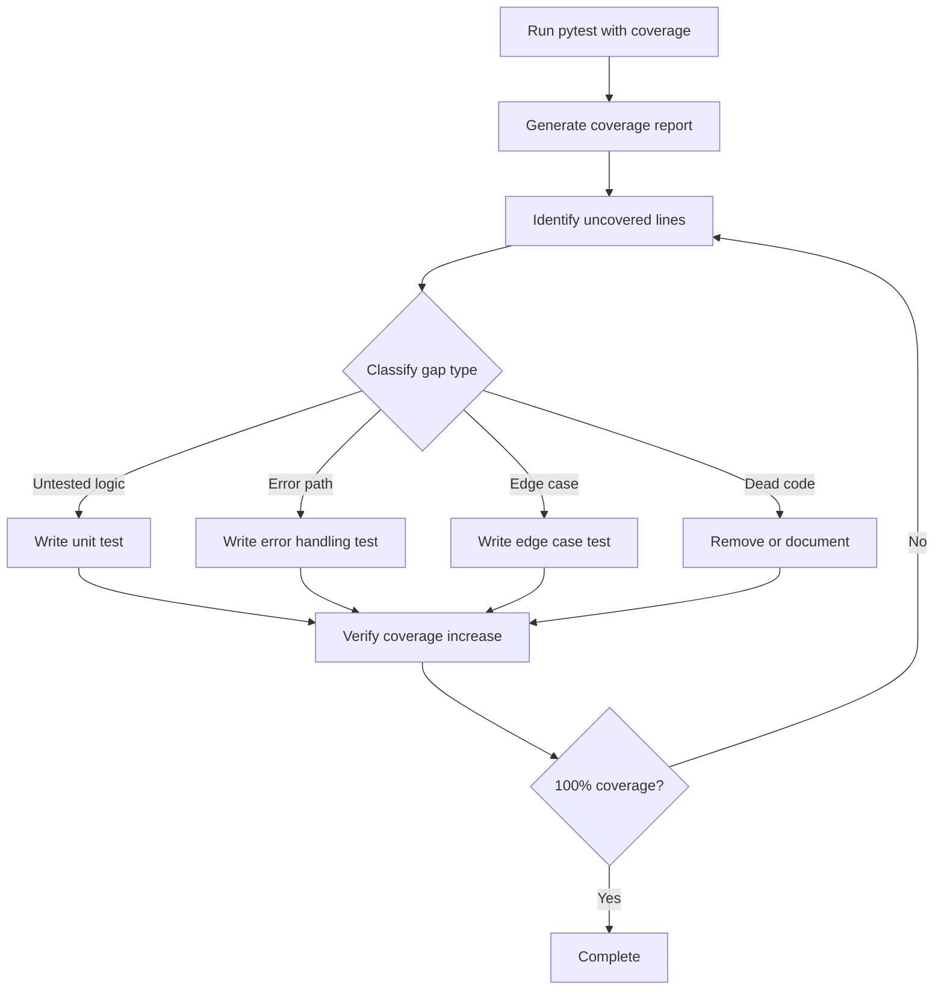

# Design Document: Comprehensive Test Coverage

## Overview

This design document outlines the architecture and implementation strategy for achieving 100% test coverage across the APGI (Allostatic Precision-Gated Ignition) system. The system currently has 1177 tests with 90% coverage threshold. This design will systematically identify and fill all coverage gaps across core modules, API services, experimental tasks, neural modules, and visualization components.

### Goals

1. Achieve 100% statement coverage across all modules (apgi_system, api)
2. Maintain high-quality tests that validate meaningful behavior, not just exercise code
3. Implement property-based tests for core algorithms to validate mathematical invariants
4. Ensure comprehensive edge case and error handling coverage
5. Create maintainable, well-documented tests that serve as living documentation
6. Optimize test execution performance for CI/CD pipelines

### Approach

The implementation will follow a systematic module-by-module approach:

1. **Coverage Analysis**: Use pytest-cov to identify uncovered lines in each module
2. **Gap Classification**: Categorize gaps as untested logic, error paths, edge cases, or dead code
3. **Test Implementation**: Write targeted tests for each gap, prioritizing meaningful validation
4. **Property Test Addition**: Add property-based tests for core algorithms with mathematical invariants
5. **Integration Testing**: Ensure subsystem interactions are properly tested
6. **Verification**: Confirm 100% coverage and validate test quality


## Architecture

### Test Organization Structure

```
tests/
├── unit/                          # Unit tests for individual functions/classes
│   ├── core/                      # Core module tests
│   │   ├── test_active_inference.py
│   │   ├── test_free_energy.py
│   │   ├── test_precision.py
│   │   └── test_predictive_processing.py
│   ├── system/                    # System-level module tests
│   │   ├── test_analysis.py
│   │   ├── test_config_validator.py
│   │   ├── test_data_export.py
│   │   ├── test_platform_utils.py
│   │   └── test_system.py
│   ├── experiments/               # Experimental task tests
│   ├── neural/                    # Neural module tests
│   ├── ignition/                  # Ignition module tests
│   ├── interoception/             # Interoception module tests
│   ├── self_model/                # Self-model module tests
│   └── visualization/             # Visualization module tests
├── property/                      # Property-based tests
│   ├── test_free_energy_properties.py
│   ├── test_precision_properties.py
│   ├── test_belief_update_properties.py
│   ├── test_serialization_properties.py
│   └── test_config_properties.py
├── integration/                   # Integration tests
│   ├── test_core_integration.py
│   ├── test_api_integration.py
│   └── test_workflow_integration.py
├── api/                          # API tests
│   ├── routes/                   # Route tests
│   ├── services/                 # Service tests
│   ├── middleware/               # Middleware tests
│   └── database/                 # Database tests
└── conftest.py                   # Shared fixtures and configuration
```

### Coverage Analysis Workflow



### Test Quality Framework

Tests will be evaluated against these quality criteria:

1. **Meaningful Assertions**: Tests must validate actual behavior, not just exercise code
2. **Clear Intent**: Test names and structure should clearly communicate what is being tested
3. **Appropriate Scope**: Unit tests test units, integration tests test interactions
4. **Maintainability**: Tests should be easy to understand and modify
5. **Performance**: Tests should execute quickly to support rapid development

## Components and Interfaces

### Coverage Analysis Component

**Purpose**: Identify uncovered code and classify coverage gaps

**Interface**:
```python
class CoverageAnalyzer:
    def analyze_module(self, module_path: str) -> CoverageReport
    def identify_gaps(self, report: CoverageReport) -> List[CoverageGap]
    def classify_gap(self, gap: CoverageGap) -> GapType
    def prioritize_gaps(self, gaps: List[CoverageGap]) -> List[CoverageGap]
```

**Key Operations**:
- Parse coverage.py output to identify uncovered lines
- Analyze AST to understand code structure and control flow
- Classify gaps as logic, error handling, edge cases, or dead code
- Prioritize gaps based on criticality and complexity

### Test Generator Component

**Purpose**: Generate test scaffolding for identified gaps

**Interface**:
```python
class TestGenerator:
    def generate_unit_test(self, gap: CoverageGap) -> str
    def generate_property_test(self, function: Function) -> str
    def generate_edge_case_test(self, gap: CoverageGap) -> str
    def generate_error_test(self, gap: CoverageGap) -> str
```

**Key Operations**:
- Generate test function scaffolding with appropriate fixtures
- Create test data based on function signatures
- Generate assertions based on expected behavior
- Add docstrings explaining test purpose

### Property Test Framework

**Purpose**: Implement property-based testing for core algorithms

**Framework**: Hypothesis (Python property-based testing library)

**Key Strategies**:
- **Generators**: Custom Hypothesis strategies for APGI data types (beliefs, precisions, observations)
- **Invariants**: Mathematical properties that must hold (e.g., probability conservation, energy monotonicity)
- **Round-trip**: Serialization/deserialization identity properties
- **Metamorphic**: Relationships between different inputs/outputs

### Test Execution Component

**Purpose**: Run tests efficiently and report results

**Configuration**:
```python
# pytest.ini
[pytest]
testpaths = tests
python_files = test_*.py
python_classes = Test*
python_functions = test_*
addopts = 
    --cov=apgi_system
    --cov=api
    --cov-report=html
    --cov-report=term-missing
    --cov-fail-under=100
    --hypothesis-profile=ci
markers =
    slow: marks tests as slow (deselect with '-m "not slow"')
    integration: marks tests as integration tests
    property: marks tests as property-based tests
```

## Data Models

### Coverage Gap Model

```python
@dataclass
class CoverageGap:
    module_path: str
    line_number: int
    line_content: str
    gap_type: GapType
    context: CodeContext
    priority: int
    
class GapType(Enum):
    UNTESTED_LOGIC = "untested_logic"
    ERROR_PATH = "error_path"
    EDGE_CASE = "edge_case"
    DEAD_CODE = "dead_code"
    
@dataclass
class CodeContext:
    function_name: str
    class_name: Optional[str]
    surrounding_lines: List[str]
    control_flow: ControlFlowInfo
```

### Test Metadata Model

```python
@dataclass
class TestMetadata:
    test_name: str
    module_tested: str
    requirements_validated: List[str]
    property_number: Optional[int]
    test_type: TestType
    execution_time: float
    
class TestType(Enum):
    UNIT = "unit"
    PROPERTY = "property"
    INTEGRATION = "integration"
    EDGE_CASE = "edge_case"
```

## Correctness Properties

*A property is a characteristic or behavior that should hold true across all valid executions of a system—essentially, a formal statement about what the system should do. Properties serve as the bridge between human-readable specifications and machine-verifiable correctness guarantees.*

Before defining the correctness properties, I need to analyze the acceptance criteria from the requirements document to determine which are testable as properties.


### Property Reflection

After analyzing the acceptance criteria, I identified the following testable properties:

**Testable Properties:**
1. Free energy mathematical invariants (13.1)
2. Precision weighting monotonicity and boundedness (13.2)
3. Belief updating probability conservation (13.3)
4. Serialization round-trip (13.4)
5. Configuration schema compliance (13.5)
6. Invalid input rejection (14.2)
7. Malformed data error handling (14.4)

**Redundancy Analysis:**
- Properties 6 and 7 (invalid input rejection and malformed data handling) are related but distinct. Invalid inputs refer to type/value violations, while malformed data refers to structural/parsing issues. Both should be kept as separate properties.
- Property 5 (configuration schema compliance) is a specific instance of property 6 (invalid input rejection) but for configuration validation specifically. However, it's worth keeping separate as it tests a specific critical subsystem.
- No other redundancies identified. Each property tests a distinct aspect of system behavior.

### Correctness Properties

Property 1: Free Energy Non-Negativity
*For any* belief state, observation, and generative model, the calculated variational free energy should be non-negative (≥ 0).
**Validates: Requirements 13.1**

Property 2: Free Energy Monotonic Decrease
*For any* initial belief state and sequence of observations, iterative belief updates should produce a monotonically decreasing or stable free energy sequence (F[t+1] ≤ F[t]).
**Validates: Requirements 13.1**

Property 3: Precision Boundedness
*For any* precision calculation, the resulting precision weight should be bounded between 0 and 1 (inclusive).
**Validates: Requirements 13.2**

Property 4: Precision Monotonicity with Confidence
*For any* two confidence values where confidence_a > confidence_b, the precision weight for confidence_a should be greater than or equal to the precision weight for confidence_b.
**Validates: Requirements 13.2**

Property 5: Belief Probability Conservation
*For any* belief state and observation, after belief updating, the sum of belief probabilities across all states should equal 1.0 (within numerical tolerance).
**Validates: Requirements 13.3**

Property 6: Belief Update Convergence
*For any* belief state and repeated identical observations, iterative belief updates should converge to a stable distribution (changes become arbitrarily small).
**Validates: Requirements 13.3**

Property 7: Serialization Round-Trip Identity
*For any* serializable system object (configuration, state, belief, etc.), serializing then deserializing should produce an object equivalent to the original.
**Validates: Requirements 13.4**

Property 8: Configuration Schema Compliance
*For any* configuration that passes validation, it should comply with all schema constraints (required fields present, types correct, values within bounds).
**Validates: Requirements 13.5**

Property 9: Invalid Input Rejection
*For any* function with input validation, providing invalid inputs (wrong types, out-of-range values, missing required fields) should raise appropriate exceptions rather than silently failing or producing incorrect results.
**Validates: Requirements 14.2**

Property 10: Malformed Data Error Handling
*For any* parsing function, providing malformed data (invalid JSON, corrupted files, incomplete structures) should raise descriptive exceptions indicating the parsing error rather than crashing or returning partial data.
**Validates: Requirements 14.4**

## Error Handling

### Error Handling Strategy

The test suite will validate error handling through multiple approaches:

1. **Explicit Error Path Testing**: Write unit tests that specifically trigger error conditions and validate error responses
2. **Property-Based Error Testing**: Use Hypothesis to generate invalid inputs and verify proper error handling
3. **Edge Case Coverage**: Test boundary conditions that commonly trigger errors
4. **Exception Type Validation**: Ensure correct exception types are raised for different error conditions
5. **Error Message Quality**: Validate that error messages are descriptive and actionable

### Error Categories to Test

**Input Validation Errors**:
- Type mismatches (string where number expected)
- Out-of-range values (negative where positive required)
- Missing required fields
- Invalid format (malformed JSON, invalid dates)

**State Errors**:
- Operations on uninitialized objects
- Invalid state transitions
- Concurrent modification conflicts

**Resource Errors**:
- File not found
- Permission denied
- Network timeouts
- Database connection failures

**Computation Errors**:
- Division by zero
- Numerical overflow/underflow
- Matrix singularity
- Convergence failures

### Error Testing Patterns

```python
# Pattern 1: Explicit error test
def test_free_energy_rejects_negative_precision():
    """Test that free energy calculation rejects negative precision values."""
    with pytest.raises(ValueError, match="Precision must be non-negative"):
        calculate_free_energy(belief=valid_belief, precision=-0.5)

# Pattern 2: Property-based error test
@given(st.floats(max_value=-0.001))
def test_precision_rejects_negative_values(negative_value):
    """Property: Any negative precision value should be rejected."""
    with pytest.raises(ValueError):
        Precision(value=negative_value)

# Pattern 3: Edge case error test
@pytest.mark.parametrize("edge_value", [0, float('inf'), float('nan')])
def test_belief_update_handles_edge_cases(edge_value):
    """Test belief update handles edge case precision values."""
    # Should either handle gracefully or raise appropriate error
    ...
```

## Testing Strategy

### Overall Testing Approach

The testing strategy employs a three-tier approach:

1. **Unit Tests**: Validate individual functions and classes in isolation
2. **Property Tests**: Validate universal mathematical and behavioral properties
3. **Integration Tests**: Validate interactions between subsystems

### Test Implementation Phases

**Phase 1: Coverage Gap Analysis**
- Run pytest with coverage to identify all uncovered lines
- Generate coverage report with line-by-line details
- Classify each gap by type and priority
- Create tracking spreadsheet of gaps by module

**Phase 2: Core Module Testing**
- Focus on apgi_system/core modules first (highest priority)
- Write unit tests for uncovered logic paths
- Add property tests for mathematical invariants
- Validate error handling for edge cases
- Verify 100% coverage for each core module before moving on

**Phase 3: System Module Testing**
- Test analysis, config_validator, data_export, platform_utils, system modules
- Focus on data transformation and validation logic
- Add round-trip property tests for serialization
- Test error handling for invalid configurations

**Phase 4: Experimental Task Testing**
- Test all experiment modules systematically
- Focus on stimulus presentation and response recording logic
- Test edge cases (empty stimuli, invalid responses)
- Validate experiment state management

**Phase 5: Neural Module Testing**
- Test neural network components
- Focus on network initialization and dynamics
- Test numerical stability and convergence
- Validate spike generation and propagation

**Phase 6: Ignition, Interoception, Self-Model Testing**
- Test higher-level cognitive modules
- Focus on state transitions and threshold crossings
- Test integration between modules
- Validate temporal dynamics

**Phase 7: Visualization Testing**
- Test visualization components (excluding GUI)
- Focus on data formatting and display logic
- Test real-time data streaming
- Validate web interface generation

**Phase 8: API Testing**
- Test all API routes, services, middleware, database modules
- Focus on request/response handling
- Test authentication and authorization
- Validate error responses and status codes
- Test rate limiting and security middleware

**Phase 9: Integration Testing**
- Test interactions between major subsystems
- Test end-to-end workflows
- Validate data flow across module boundaries
- Test concurrent operations

**Phase 10: Final Verification**
- Run full test suite with coverage
- Verify 100% coverage achieved
- Review test quality and maintainability
- Document any intentional coverage exclusions
- Update CI/CD configuration

### Property-Based Testing Configuration

**Framework**: Hypothesis (Python property-based testing library)

**Configuration**:
```python
# conftest.py
from hypothesis import settings, Verbosity

# CI profile: balanced thoroughness and speed
settings.register_profile("ci", max_examples=100, verbosity=Verbosity.normal)

# Development profile: faster feedback
settings.register_profile("dev", max_examples=20, verbosity=Verbosity.normal)

# Thorough profile: maximum coverage
settings.register_profile("thorough", max_examples=1000, verbosity=Verbosity.verbose)

# Load profile from environment
settings.load_profile(os.getenv("HYPOTHESIS_PROFILE", "dev"))
```

**Custom Strategies**:
```python
# strategies.py - Custom Hypothesis strategies for APGI types

@st.composite
def belief_states(draw):
    """Generate valid belief state distributions."""
    size = draw(st.integers(min_value=2, max_value=10))
    values = draw(st.lists(st.floats(min_value=0, max_value=1), 
                          min_size=size, max_size=size))
    # Normalize to sum to 1
    total = sum(values)
    if total > 0:
        return np.array([v / total for v in values])
    return np.ones(size) / size

@st.composite
def precision_values(draw):
    """Generate valid precision weights."""
    return draw(st.floats(min_value=0.0, max_value=1.0, 
                         exclude_min=False, exclude_max=False))

@st.composite
def observations(draw):
    """Generate valid observations."""
    size = draw(st.integers(min_value=1, max_value=10))
    return draw(st.lists(st.floats(min_value=-10, max_value=10),
                        min_size=size, max_size=size))

@st.composite
def configurations(draw):
    """Generate valid system configurations."""
    return {
        'learning_rate': draw(st.floats(min_value=0.001, max_value=0.1)),
        'precision_threshold': draw(st.floats(min_value=0.0, max_value=1.0)),
        'max_iterations': draw(st.integers(min_value=1, max_value=1000)),
        'convergence_tolerance': draw(st.floats(min_value=1e-6, max_value=1e-2))
    }
```

### Test Quality Standards

**Meaningful Tests**:
- Tests must validate actual behavior, not just exercise code
- Avoid trivial tests that only check framework behavior
- Focus on business logic and correctness properties
- Each test should have clear purpose documented

**Test Structure**:
```python
def test_feature_behavior():
    """Clear description of what is being tested and why.
    
    This test validates that [specific behavior] works correctly
    when [specific conditions]. It covers requirement X.Y.
    """
    # Arrange: Set up test data and preconditions
    input_data = create_test_data()
    expected_output = calculate_expected_result(input_data)
    
    # Act: Execute the code under test
    actual_output = function_under_test(input_data)
    
    # Assert: Verify the results
    assert actual_output == expected_output
    assert validate_invariants(actual_output)
```

**Property Test Structure**:
```python
@given(belief_states(), observations())
def test_belief_update_preserves_probability(belief, observation):
    """Property: Belief updates preserve probability normalization.
    
    Feature: comprehensive-test-coverage, Property 5
    Validates: Requirements 13.3
    
    For any belief state and observation, the updated belief
    should sum to 1.0 (within numerical tolerance).
    """
    updated_belief = update_belief(belief, observation)
    assert abs(sum(updated_belief) - 1.0) < 1e-6
```

### Test Execution Configuration

**pytest Configuration** (pytest.ini):
```ini
[pytest]
testpaths = tests
python_files = test_*.py
python_classes = Test*
python_functions = test_*

addopts = 
    --cov=apgi_system
    --cov=api
    --cov-report=html:htmlcov
    --cov-report=term-missing
    --cov-report=json:coverage.json
    --cov-fail-under=100
    --hypothesis-profile=ci
    -v
    --tb=short
    --strict-markers

markers =
    slow: marks tests as slow (deselect with '-m "not slow"')
    integration: marks tests as integration tests
    property: marks tests as property-based tests
    unit: marks tests as unit tests
    edge_case: marks tests as edge case tests

# Exclude GUI modules from coverage
[coverage:run]
omit =
    */apgi_gui.py
    */*_GUI.py
    */tests/*
    */conftest.py
```

**CI/CD Integration**:
```yaml
# .github/workflows/test.yml
name: Test Suite

on: [push, pull_request]

jobs:
  test:
    runs-on: ubuntu-latest
    steps:
      - uses: actions/checkout@v2
      - uses: actions/setup-python@v2
        with:
          python-version: '3.9'
      - name: Install dependencies
        run: |
          pip install -r requirements.txt
          pip install pytest pytest-cov hypothesis
      - name: Run tests with coverage
        env:
          HYPOTHESIS_PROFILE: ci
        run: pytest --cov --cov-fail-under=100
      - name: Upload coverage report
        uses: codecov/codecov-action@v2
        with:
          files: ./coverage.json
```

### Performance Optimization

**Parallel Execution**:
```bash
# Run tests in parallel using pytest-xdist
pytest -n auto --cov --cov-fail-under=100
```

**Test Categorization**:
```python
# Mark slow tests
@pytest.mark.slow
def test_large_network_simulation():
    """Test that takes >1 second to run."""
    ...

# Run fast tests only during development
pytest -m "not slow"

# Run all tests in CI
pytest
```

**Fixture Optimization**:
```python
# Use session-scoped fixtures for expensive setup
@pytest.fixture(scope="session")
def large_test_dataset():
    """Load large dataset once per test session."""
    return load_dataset()

# Use function-scoped fixtures for test isolation
@pytest.fixture(scope="function")
def clean_database():
    """Provide clean database for each test."""
    db = create_test_database()
    yield db
    db.cleanup()
```

### Coverage Verification

**Coverage Goals**:
- 100% statement coverage for all apgi_system modules
- 100% statement coverage for all api modules
- Exclude GUI modules (apgi_gui.py, *_GUI.py)
- Exclude test files themselves

**Coverage Monitoring**:
```bash
# Generate detailed coverage report
pytest --cov --cov-report=html

# View uncovered lines
pytest --cov --cov-report=term-missing

# Fail if coverage below 100%
pytest --cov --cov-fail-under=100
```

**Coverage Analysis Tools**:
- coverage.py: Core coverage measurement
- pytest-cov: pytest integration
- HTML reports: Visual coverage inspection
- JSON reports: Programmatic coverage analysis

### Test Maintenance

**Documentation Requirements**:
- Every test must have a docstring explaining its purpose
- Property tests must reference design document property number
- Tests must reference requirements they validate
- Complex test scenarios must include inline comments

**Review Checklist**:
- [ ] Test has clear, descriptive name
- [ ] Test has docstring explaining purpose
- [ ] Test follows Arrange-Act-Assert pattern
- [ ] Test validates meaningful behavior
- [ ] Test uses appropriate fixtures
- [ ] Test has clear assertions with messages
- [ ] Property tests reference design properties
- [ ] Tests reference requirements validated

**Refactoring Guidelines**:
- Extract common test setup into fixtures
- Use parametrize for similar test cases
- Create custom assertions for complex validations
- Keep tests focused on single behavior
- Avoid test interdependencies

